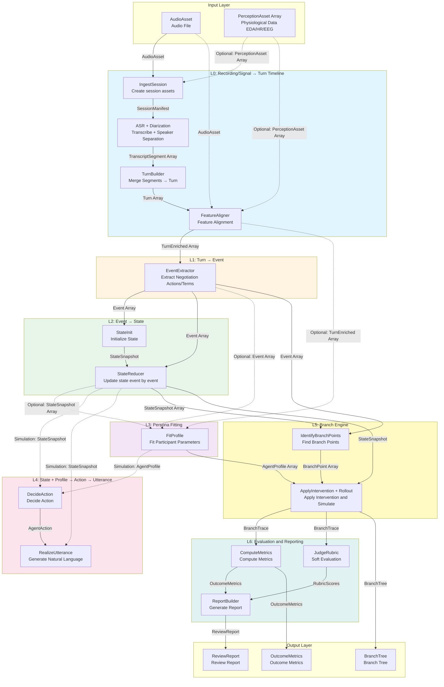
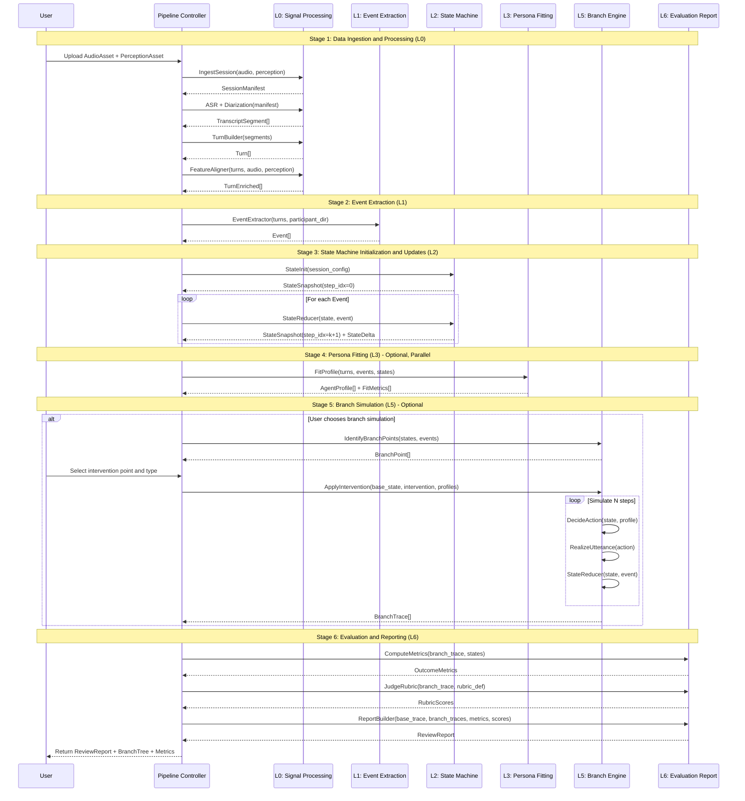
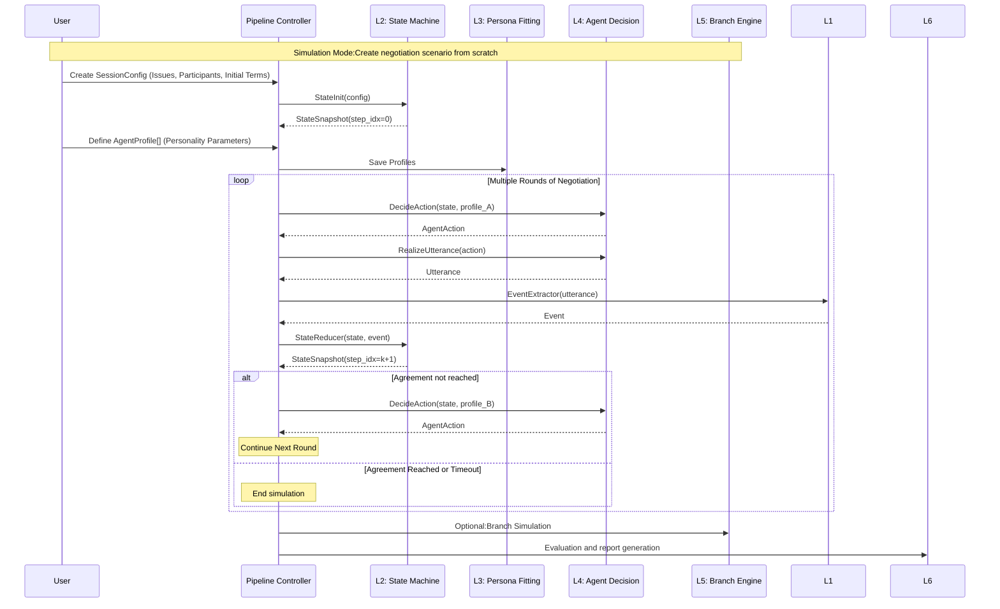

# Pipeline Data Flow and Sequence Diagrams

This document contains the Pipeline Data Flow Diagram (DFD) and Sequence Diagram for the negotiation analysis system, visualizing the complete flow from raw audio input to final evaluation reports.

---

## 1. Pipeline DFD (L0–L6 Global Data Flow)

### 1.1 Complete Data Flow Diagram



### 1.2 Data Flow Description and Schema

#### L0 Layer: Recording/Signal → Turn Timeline

**Input**:
- `AudioAsset`:Audio File(Required)
- `PerceptionAsset[]`:Physiological Data(Optional)

**Processing Steps**:
1. **IngestSession**: Create session assets, generates `SessionManifest`
2. **ASR + Diarization**: Speech-to-text + Speaker Separation, generates `TranscriptSegment[]`
3. **TurnBuilder**: Merges segments into complete turns, generates `Turn[]`
4. **FeatureAligner**: Aligns audio and physiological features, generates `TurnEnriched[]`

**Output**:`TurnEnriched[]`(Complete turn sequence with timestamps, speakers, audio features, and physiological features)

##### Schema Definitions

**Input: AudioAsset**
```json
{
  "session_id": "uuid",
  "audio_uri": "s3://.../audio.wav",
  "sample_rate_hz": 16000,
  "duration_sec": 1832.4,
  "channels": 1,
  "recorded_at": "2026-01-22T18:03:11Z",
  "timezone": "America/New_York"
}
```

**Field Descriptions**:
- `session_id` (string, UUID): Unique identifier for a negotiation/meeting
- `audio_uri` (string): Audio FileLocation in the storage system(S3 URI or other storage path)
- `sample_rate_hz` (integer): Audio sample rate in Hz, common values like 16000, 44100
- `duration_sec` (float): Total audio duration in seconds
- `channels` (integer): Number of audio channels, 1=mono, 2=stereo
- `recorded_at` (string, ISO 8601): Timestamp of recording time
- `timezone` (string): Recording timezone, for alignment with external data (e.g., Physiological Data)

**Input: PerceptionAsset** (Optional)
```json
{
  "session_id": "uuid",
  "participant_id": "uuid",
  "modality": "EDA",
  "data_uri": "s3://.../eda.csv",
  "sample_rate_hz": 32,
  "time_base": "unix_epoch_ms",
  "start_time_ms": 1737578591000
}
```

**Field Descriptions**:
- `session_id` (string, UUID): Unique identifier of the session
- `participant_id` (string, UUID): ID of the participant (wearer) to whom this sensor data belongs
- `modality` (string, enum): Physiological/perception data type, optional values: `EDA` (Electrodermal Activity), `HR` (Heart Rate), `HRV` (Heart Rate Variability), `EEG` (Electroencephalography), `RESP` (Respiration), `TEMP` (Skin/Body Temperature), `EYE` (Eye Movement), `ACC` (Acceleration)
- `data_uri` (string): Location of physiological data file in the storage system
- `sample_rate_hz` (integer): Physiological data sample rate in Hz
- `time_base` (string, enum): Time base type, optional values: `unix_epoch_ms` (Unix timestamp in milliseconds), `unix_epoch_sec` (Unix timestamp in seconds), `relative_sec` (Relative start seconds)
- `start_time_ms` (integer): Data start time in milliseconds (interpreted according to time_base)

**Output: SessionManifest** (L0.1)
```json
{
  "session_id": "uuid",
  "assets": {
    "audio": {"audio_uri":"..."},
    "perception": [{"modality":"EDA","data_uri":"..."}]
  },
  "status": "INGESTED"
}
```

**Field Descriptions**:
- `session_id` (string, UUID): Session unique identifier
- `assets.audio` (object): Audio asset information, contains `audio_uri` (Audio file location)
- `assets.perception` (array): Physiological data asset list, each element contains `modality` (Data type) and `data_uri` (Data file location)
- `status` (string, enum): Session status, optional values: `INGESTED` (Ingested), `PENDING` (Pending), `RUNNING` (Running), `SUCCEEDED` (Succeeded), `FAILED` (Failed)

**Output: TranscriptSegment[]** (L0.2)
```json
{
  "session_id": "uuid",
  "segment_index": 0,
  "t0_sec": 12.30,
  "t1_sec": 18.90,
  "speaker_id": "spk_0",
  "text": "We can only do 120k.",
  "asr_confidence": 0.92,
  "words": [
    {"t0_sec":12.35,"t1_sec":12.60,"w":"We","conf":0.94},
    {"t0_sec":12.61,"t1_sec":12.90,"w":"can","conf":0.93}
  ]
}
```

**Field Descriptions**:
- `session_id` (string, UUID): Unique identifier of the session
- `segment_index` (integer): Sequential index of segment in session (starting from 0)
- `t0_sec` (float): Start time of this segment in audio, in seconds
- `t1_sec` (float): End time of this segment in audio, in seconds
- `speaker_id` (string): Speaker label (audio layer), Format like `spk_0`、`spk_1`, Will be mapped to real `participant_id`
- `text` (string): Transcribed text content
- `asr_confidence` (float, 0.0-1.0): Confidence score of automatic speech recognition (ASR)
- `words` (array, Optional): Word-level timestamp array, each element contains:
  - `t0_sec` (float): Word start time
  - `t1_sec` (float): Word end time
  - `w` (string): Word text
  - `conf` (float): Recognition confidence of this word

**Output: Turn[]** (L0.3)
```json
{
  "session_id": "uuid",
  "turn_id": "uuid",
  "turn_index": 12,
  "t0_sec": 120.10,
  "t1_sec": 141.85,
  "speaker_id": "spk_0",
  "participant_id": null,
  "text": "We can only do 120k and we'd need delivery by March.",
  "lang": "en",
  "source_segments": [33,34,35]
}
```

**Field Descriptions**:
- `session_id` (string, UUID): Unique identifier of the session
- `turn_id` (string, UUID): Unique identifier of this turn (UUID or `{session_id}:{index}` format)
- `turn_index` (integer): Sequential number of turn in session (starting from 0)
- `t0_sec` (float): Start time of turn in audio, in seconds
- `t1_sec` (float): End time of turn in audio, in seconds
- `speaker_id` (string): Speaker label (audio layer), such as `spk_0`, `spk_1`
- `participant_id` (string, UUID, nullable): Real participant ID, Before speaker→participant mapping is complete, it is `null`
- `text` (string): Complete turn text (merged from multiple segments)
- `lang` (string, ISO 639-1): Language code, such as `en` (English), `zh` (Chinese)
- `source_segments` (array of integers): Which `TranscriptSegment` merged from (segment_index list), for traceability

**Output: TurnEnriched[]** (L0.4)
```json
{
  "session_id": "uuid",
  "turn_id": "uuid",
  "t0_sec": 120.10,
  "t1_sec": 141.85,
  "speaker_id": "spk_0",
  "text": "...",
  "audio_features": {
    "speech_rate_wps": 2.9,
    "mean_pitch_hz": 185.2,
    "pitch_std_hz": 22.4,
    "energy_rms": 0.031,
    "pause_total_ms": 420
  },
  "physio_features": {
    "EDA": {
      "window": {"t0_sec":118.10,"t1_sec":143.85},
      "eda_mean": 0.12,
      "eda_slope": 0.008
    }
  }
}
```

**Field Descriptions**:
- `session_id` (string, UUID): Unique identifier of the session
- `turn_id` (string, UUID): Unique identifier of this turn
- `t0_sec` (float): Turn start time in seconds
- `t1_sec` (float): Turn end time in seconds
- `speaker_id` (string): Speaker label
- `text` (string): Turn text (inherited from Turn)
- `audio_features` (object): Audio features, contains:
  - `speech_rate_wps` (float): Speech rate in words per second
  - `mean_pitch_hz` (float): Mean fundamental frequency in Hz, reflects pitch level
  - `pitch_std_hz` (float): Fundamental frequency standard deviation in Hz, reflects pitch variation
  - `energy_rms` (float): Audio energy (RMS), reflects volume level
  - `pause_total_ms` (integer): Total pause duration within turn, in milliseconds
- `physio_features` (object, Optional): Physiological features, key is `modality` (such as `EDA`), value is:
  - `window` (object): Time window for extracting physiological features, usually slightly expanded from turn
    - `t0_sec` (float): Window start time
    - `t1_sec` (float): Window end time
  - `eda_mean` (float, Example): Mean EDA value within this window
  - `eda_slope` (float, Example): EDA trend slope within this window, positive value indicates tension/arousal increase

---

#### L1 Layer: Turn → Event

**Input**:
- `TurnEnriched[]`
- `ParticipantDirectory`(Optional, For mapping speakers)

**Processing Steps**:
1. **EventExtractor**:Extract negotiation actions and terms from each Turn

**Output**:`Event[]`(Contains act_type, terms, stance, intent, tone, etc.)

##### Schema Definitions

**Input: ParticipantDirectory** (Optional)
```json
{
  "session_id":"uuid",
  "speaker_to_participant": {
    "spk_0": "uuid-A",
    "spk_1": "uuid-B"
  },
  "participants": [
    {"participant_id":"uuid-A","display_name":"Person A","role":"Seller"},
    {"participant_id":"uuid-B","display_name":"Person B","role":"Buyer"}
  ]
}
```

**Field Descriptions**:
- `session_id` (string, UUID): Unique identifier of the session
- `speaker_to_participant` (object): Mapping table from speaker ID to participant ID, key is `speaker_id` (such as `spk_0`), value is `participant_id` (UUID)
- `participants` (array): Participant information list, each element contains:
  - `participant_id` (string, UUID): Unique identifier of participant
  - `display_name` (string): Display name (for UI and reports)
  - `role` (string): Role, such as `Seller` (Seller), `Buyer` (Buyer)

**Output: Event[]**
```json
{
  "session_id": "uuid",
  "event_id": "uuid",
  "turn_id": "uuid",
  "actor_participant_id": "uuid-A",
  "act_type": "ANCHOR",
  "act_subtype": null,
  "targets": ["uuid-B"],
  "terms": [
    {
      "term_type": "PRICE",
      "value": 120000,
      "currency": "USD",
      "confidence": 0.86,
      "evidence": {"text_span":"120k","char_start":17,"char_end":21}
    }
  ],
  "stance": "FIRM",
  "intent": "SET_BASELINE",
  "tone": {
    "valence": -0.1,
    "arousal": 0.4,
    "confidence": 0.7
  }
}
```

**Field Descriptions**:
- `session_id` (string, UUID): Unique identifier of the session
- `event_id` (string, UUID): Unique identifier of this negotiation action event
- `turn_id` (string, UUID): Source Turn ID
- `actor_participant_id` (string, UUID): ID of participant who performed this action
- `act_type` (string, enum): Action type, optional values: `OFFER` (Offer), `COUNTER` (Counter), `CONCEDE` (Concede), `ACCEPT` (Accept), `REJECT` (Reject), `ASK` (Ask), `DISCLOSE` (Disclose), `SUMMARIZE` (Summarize), `ANCHOR` (Anchor), `JUSTIFY` (Justify), `REFRAME` (Reframe), `BUILD_RAPPORT` (Build Rapport), `THREATEN` (Threaten), `PAUSE` (Pause)
- `act_subtype` (string, nullable): Action subtype, optional, such as subtypes of `THREATEN`: `WALK_AWAY`, `DEADLINE`, `ESCALATE`
- `targets` (array of UUIDs): List of participant IDs this statement primarily targets (can be empty or multiple people)
- `terms` (array): Term extraction list, each element contains:
  - `term_type` (string, enum): Term type, such as `PRICE` (Price), `DEADLINE` (Deadline), `SCOPE` (Scope), `PAYMENT_TERMS` (Payment Terms), etc.
  - `value` (number/string): Normalized value (e.g., 120k→120000) or text value
  - `currency` (string, Optional): Currency code, such as `USD`, `CNY`
  - `confidence` (float, 0.0-1.0): Extraction confidence
  - `evidence` (object): Position evidence in original turn text, for explainability/highlighting:
    - `text_span` (string): Original text span
    - `char_start` (integer): Character start position
    - `char_end` (integer): Character end position
- `stance` (string, enum): Attitude/openness level, optional values: `FIRM` (Firm), `OPEN` (Open), `CONDITIONAL` (Conditional), `HESITANT` (Hesitant), `NONCOMMITTAL` (Noncommittal)
- `intent` (string, enum): High-level intent, optional values: `SET_BASELINE` (Set Baseline), `SEEK_CONCESSION` (Seek Concession), `TEST_LIMITS` (Test Limits), `SHARE_CONSTRAINT` (Share Constraint), `BUILD_TRUST` (Build Trust), `REDUCE_TENSION` (De-escalate), `GAIN_TIME` (Gain Time), `CLOSE_DEAL` (Close Deal), `SHIFT_TOPIC` (Shift Topic), `ESCALATE_PRESSURE` (Escalate Pressure)
- `tone` (object): Structured representation of emotion/tone (can be inferred from audio+text fusion):
  - `valence` (float, -1.0 to 1.0): Emotional valence, negative=negative, positive=positive
  - `arousal` (float, 0.0 to 1.0): Arousal level, 0=calm, 1=excited
  - `confidence` (float, 0.0-1.0): Confidence of tone recognition

---

#### L2 Layer: Event → State

**Input**:
- `SessionConfig`(For initialization)
- `Event[]`(For state updates)
- `AgentProfile[]`(Optional, For more reasonable updates)

**Processing Steps**:
1. **StateInit**:Initialize negotiation world state
2. **StateReducer**:Update state event by event, Generate state snapshot sequence

**Output**:
- `StateSnapshot[]`(State for each step_idx)
- `StateDelta[]`(State change description)

##### Schema Definitions

**Input: SessionConfig** (L2.1)
```json
{
  "session_id":"uuid",
  "issues":[
    {"term_type":"PRICE","unit":"USD"},
    {"term_type":"DEADLINE","unit":"ISO_DATE"}
  ],
  "initial_terms": {},
  "participants":[
    {"participant_id":"uuid-A","role":"Seller"},
    {"participant_id":"uuid-B","role":"Buyer"}
  ]
}
```

**Field Descriptions**:
- `session_id` (string, UUID): Session unique identifier
- `issues` (array): Negotiation issue list, each element contains:
  - `term_type` (string, enum): Term type, such as `PRICE`, `DEADLINE`, `SCOPE`, etc.
  - `unit` (string): Unit, such as `USD` (USD), `ISO_DATE` (ISO date format)
- `initial_terms` (object): Initial term values (structured), key is `term_type`, value is corresponding initial value
- `participants` (array): Participant list, each element contains:
  - `participant_id` (string, UUID): Participant unique identifier
  - `role` (string): Role, such as `Seller` (Seller), `Buyer` (Buyer)

**Output: StateSnapshot** (L2.1)
```json
{
  "session_id":"uuid",
  "state_id":"uuid",
  "step_idx": 0,
  "last_event_id": null,
  "terms": {},
  "beliefs": {},
  "relationship": {"trust": 0.5, "tension": 0.0},
  "emotion": {"uuid-A":{"anger":0.0,"stress":0.2},"uuid-B":{"anger":0.0,"stress":0.2}},
  "meta": {"round":1}
}
```

**Field Descriptions**:
- `session_id` (string, UUID): Session unique identifier
- `state_id` (string, UUID): Unique identifier of this state snapshot
- `step_idx` (integer): Discrete simulation step number (0, 1, 2...), usually aligned with event sequence
- `last_event_id` (string, UUID, nullable): Previous event ID that caused this state, initial state is `null`
- `terms` (object): Current terms (structured), key is `term_type` (such as `PRICE`), value is corresponding current value
- `beliefs` (object): Estimate of opponent's bottom line/preferences (probability distribution/range), key is `belief_key` (such as `opponent_min_price`), value is distribution parameters
- `relationship` (object): Relationship state, contains:
  - `trust` (float, 0.0-1.0): Trust level, 0=no trust, 1=complete trust
  - `tension` (float, 0.0-1.0): Adversarial/tension level, 0=harmonious, 1=highly tense
  - `alignment` (float, 0.0-1.0): Goal alignment/cooperation tendency, 0=opposition, 1=alignment
- `emotion` (object): Emotional state of each participant, key is `participant_id`, value is emotion dimension object:
  - `anger` (float, 0.0-1.0): Anger/hostility
  - `stress` (float, 0.0-1.0): Stress/tension
  - `confidence` (float, 0.0-1.0): Confidence/sense of control
  - `warmth` (float, 0.0-1.0): Friendliness/affinity
- `meta` (object): Metadata, contains:
  - `round` (integer): Negotiation round (round logic can be customized)

**Output: StateDelta** (L2.2)
```json
{
  "session_id":"uuid",
  "from_state_id":"uuid_prev",
  "to_state_id":"uuid_next",
  "event_id":"uuid_evt",
  "deltas": {
    "terms": [{"op":"SET","path":"$.PRICE","value":120000}],
    "relationship": [{"op":"ADD","path":"$.tension","value":0.10}],
    "emotion": [{"op":"ADD","path":"$.uuid-B.stress","value":0.15}]
  },
  "rationale": "Anchor increased tension slightly; buyer stress rose due to high initial price."
}
```

**Field Descriptions**:
- `session_id` (string, UUID): Session unique identifier
- `from_state_id` (string, UUID): Source state ID
- `to_state_id` (string, UUID): Target state ID
- `event_id` (string, UUID): Event ID that caused this change
- `deltas` (object): Describe changes in JSON patch-like form (beneficial for replay/branching), key is state field name (such as `terms`, `relationship`, `emotion`), value is operation list, each operation contains:
  - `op` (string, enum): Operation type, such as `SET` (Set), `ADD` (Add), `REMOVE` (Remove)
  - `path` (string): JSON path, such as `$.PRICE`, `$.tension`, `$.uuid-B.stress`
  - `value` (any): Operation value
- `rationale` (string, Optional): Explanation of the reason for the change

---

#### L3 Layer: Persona Fitting

**Input**:
- `TurnEnriched[]`
- `Event[]`
- `StateSnapshots[]`(Optional but very helpful)

**Processing Steps**:
1. **FitProfile**:Fit behavioral parameters for each participant from trajectory

**Output**:
- `AgentProfile[]`(traits、tactic_priors、trigger_rules、utility_weights)
- `FitMetrics[]`(Fitting quality metrics)

##### Schema Definitions

**Output: AgentProfile**
```json
{
  "session_id":"uuid",
  "participant_id":"uuid-A",
  "profile_version":"v1",
  "traits": {
    "dominance": 0.78,
    "agreeableness": 0.22,
    "risk_aversion": 0.55
  },
  "tactic_priors": {
    "ANCHOR": 0.60,
    "CONCEDE": 0.20,
    "THREATEN": 0.05,
    "ASK": 0.15
  },
  "trigger_rules": [
    {
      "trigger_id":"t1",
      "condition": {"type":"INTERRUPT_COUNT_GTE","value":2},
      "effect": {"emotion_delta":{"anger":0.25}}
    }
  ],
  "utility_weights": {
    "PRICE": 0.60,
    "TIME": 0.15,
    "RELATIONSHIP": 0.25
  }
}
```

**Field Descriptions**:
- `session_id` (string, UUID): Session unique identifier
- `participant_id` (string, UUID): ID of participant to whom this Profile belongs
- `profile_version` (string): Profile version number, such as `v1`
- `traits` (object): Stable personality/behavioral traits (0-1 normalized), contains:
  - `dominance` (float, 0.0-1.0): Dominance/assertiveness level
  - `agreeableness` (float, 0.0-1.0): Agreeableness/cooperation level
  - `risk_aversion` (float, 0.0-1.0): Risk aversion level
  - `patience` (float, 0.0-1.0): Patience/willingness to delay level
  - `emotional_reactivity` (float, 0.0-1.0): Emotional reactivity intensity (tendency to escalate)
- `tactic_priors` (object): Action prior probability (normalized sum≈1), key is `act_type`, value is probability of this action
- `trigger_rules` (array): Trigger rule list, each element contains:
  - `trigger_id` (string): Unique identifier of trigger
  - `condition` (object): Trigger condition, contains:
    - `type` (string, enum): Condition type, such as `INTERRUPT_COUNT_GTE` (Interruption count ≥ N), `TENSION_GTE` (Tension ≥ threshold), `CONCESSION_FROM_OPPONENT` (Opponent concession occurs)
    - `value` (number): Condition threshold or parameter
  - `effect` (object): Trigger effect, contains:
    - `emotion_delta` (object, Optional): Emotion delta, key is emotion dimension (such as `anger`, `stress`), value is delta value
    - `tactic_prior_shift` (object, Optional): Tactic prior shift
    - `tone_style_override` (string, Optional): Force tone style override
- `utility_weights` (object): Utility weights (for L4/L6), key is `term_type` or general dimension (such as `TIME`, `RELATIONSHIP`), value is weight (sum usually 1.0)

**Output: FitMetrics**
```json
{
  "session_id":"uuid",
  "participant_id":"uuid-A",
  "next_act_prediction_f1": 0.61,
  "confidence": 0.72,
  "notes": "Profile explains most concessions but underpredicts threats."
}
```

**Field Descriptions**:
- `session_id` (string, UUID): Session unique identifier
- `participant_id` (string, UUID): ID of participant to whom this metric belongs
- `next_act_prediction_f1` (float, 0.0-1.0): F1 score of predicting next action using this Profile (measures fitting quality)
- `confidence` (float, 0.0-1.0): Fitting confidence
- `notes` (string): Fitting quality description and notes

---

#### L4 Layer: State + Profile → Action → Utterance (For Simulation)

**Input**:
- `StateSnapshot`
- `AgentProfile`
- `LastKContext`(Summary of last K events)

**Processing Steps**:
1. **DecideAction**:Decide next action based on state and personality
2. **RealizeUtterance**:Converts action to natural language

**Output**:
- `AgentAction[]`
- `Utterance[]`

##### Schema Definitions

**Output: AgentAction** (L4.1)
```json
{
  "session_id":"uuid",
  "step_idx": 35,
  "actor_participant_id":"uuid-B",
  "action": {
    "act_type":"COUNTER",
    "terms":[{"term_type":"PRICE","value":95000,"currency":"USD"}],
    "tone_style":"CALM",
    "strategy_tags":["SIGNAL_LIMIT","KEEP_RELATIONSHIP"],
    "rationale":"Counter to move anchor down while maintaining rapport."
  }
}
```

**Field Descriptions**:
- `session_id` (string, UUID): Session unique identifier
- `step_idx` (integer): Step index where this action occurred
- `actor_participant_id` (string, UUID): ID of participant who performed this action
- `action` (object): Action details, contains:
  - `act_type` (string, enum): Action type (Same as Event.act_type)
  - `terms` (array): Term list (Same as Event.terms)
  - `tone_style` (string, enum): Language style/tone, optional values: `CALM` (Calm), `ASSERTIVE` (Assertive), `FRIENDLY` (Friendly), `APOLOGETIC` (Apologetic), `AGGRESSIVE` (Aggressive), `FORMAL` (Formal), `CASUAL` (Casual), `UNCERTAIN` (Uncertain)
  - `strategy_tags` (array of strings): Strategy tags for decision explanation/teaching, optional values: `SIGNAL_LIMIT` (Signal Limit), `PROBE_LIMIT` (Probe Limit), `TRADE_OFF` (Trade Off), `SPLIT_THE_DIFFERENCE` (Split the Difference), `PACKAGE_DEAL` (Package Deal), `SLOW_CONCEDE` (Slow Concede), `FAST_CLOSE` (Fast Close), `DE_ESCALATE` (De-escalate), etc.
  - `rationale` (string): Decision rationale description

**Output: Utterance** (L4.2)
```json
{
  "session_id":"uuid",
  "step_idx":35,
  "actor_participant_id":"uuid-B",
  "text":"I hear you. Given our constraints, we could move forward at $95k if we can lock the March delivery date.",
  "constraints_check": {
    "terms_consistent": true,
    "no_new_terms_introduced": true
  }
}
```

**Field Descriptions**:
- `session_id` (string, UUID): Session unique identifier
- `step_idx` (integer): Step index where this utterance occurred
- `actor_participant_id` (string, UUID): ID of participant who made this utterance
- `text` (string): Generated natural language text
- `constraints_check` (object): Automatic validation result, contains:
  - `terms_consistent` (boolean): Whether terms in language are consistent with terms in AgentAction
  - `no_new_terms_introduced` (boolean): Whether new terms not defined in AgentAction were introduced (should be `true`）

---

#### L5 Layer: Branch Engine

**Input**:
- `StateSnapshots[]`
- `Events[]`
- `Intervention`(User-specified intervention)
- `Profiles[]`

**Processing Steps**:
1. **IdentifyBranchPoints**:Identify key branch points
2. **ApplyIntervention + Rollout**:Apply intervention and simulate future

**Output**:
- `BranchPoint[]`
- `BranchTrace[]` / `BranchTree`

##### Schema Definitions

**Output: BranchPoint[]** (L5.1)
```json
{
  "session_id":"uuid",
  "branch_point_id":"uuid",
  "step_idx": 28,
  "reason": "High tension jump after THREATEN",
  "candidate_interventions": [
    {"type":"REPLACE_ACT","from":"THREATEN","to":"REFRAME"},
    {"type":"CLAMP_EMOTION","participant_id":"uuid-A","field":"anger","value":0.0}
  ]
}
```

**Field Descriptions**:
- `session_id` (string, UUID): Session unique identifier
- `branch_point_id` (string, UUID): Unique identifier of branch point
- `step_idx` (integer): Step index where branch point is located
- `reason` (string): Reason description for identifying this branch point
- `candidate_interventions` (array): Candidate intervention list, each element contains:
  - `type` (string, enum): Intervention type, such as `REPLACE_ACT` (Replace Action), `CLAMP_EMOTION` (Clamp Emotion), `EDIT_TERMS` (Edit Terms), etc.
  - `from` (string, Optional): Source value (such as source action type of `REPLACE_ACT`)
  - `to` (string, Optional): Target value (such as target action type of `REPLACE_ACT`)
  - `participant_id` (string, UUID, Optional): Target participant ID
  - `field` (string, Optional): Target field (such as `anger`, `stress`)
  - `value` (any, Optional): Target value

**Input: Intervention** (L5.2)
```json
{
  "type":"CLAMP_EMOTION",
  "participant_id":"uuid-A",
  "field":"anger",
  "value":0.0,
  "duration_steps": 3
}
```

**Field Descriptions**:
- `type` (string, enum): Intervention type, optional values: `REPLACE_ACT` (Replace an action), `EDIT_TERMS` (Edit Terms), `CLAMP_EMOTION` (Clamp Emotion), `ADD_TRIGGER` (Add Trigger), `REMOVE_EVENT` (Remove an event), `INFO_HIDE` (Info Hide), `POLICY_SHIFT` (Temporarily change profile parameters)
- `participant_id` (string, UUID): Target participant ID
- `field` (string): Target field, such as emotion dimension (`anger`, `stress`) or other state fields
- `value` (any): Target value
- `duration_steps` (integer): Intervention duration in steps (if 0 or unspecified, continues until simulation ends)

**Output: BranchTrace**
```json
{
  "session_id":"uuid",
  "branch_id":"b1",
  "parent_branch_id": null,
  "start_step_idx": 28,
  "steps":[
    {"step_idx":29,"state_id":"...","action_id":"...","utterance_id":"..."},
    {"step_idx":30,"state_id":"...","action_id":"...","utterance_id":"..."}
  ]
}
```

**Field Descriptions**:
- `session_id` (string, UUID): Session unique identifier
- `branch_id` (string): Unique identifier of branch path
- `parent_branch_id` (string, nullable): Parent branch ID (if it is a child branch), `null` represents root branch
- `start_step_idx` (integer): Step index where branch starts
- `steps` (array): Step list in branch path, each element contains:
  - `step_idx` (integer): Step index
  - `state_id` (string, UUID): State snapshot ID of this step
  - `action_id` (string, UUID): Action ID of this step(Optional)
  - `utterance_id` (string, UUID): Utterance ID of this step(Optional)

---

#### L6 Layer: Evaluation and Reporting

**Input**:
- `BranchTrace`
- `StateSnapshots`
- `RubricDefinition`

**Processing Steps**:
1. **ComputeMetrics**:Computes rule-based metrics
2. **JudgeRubric**:Soft evaluation (language/strategy)
3. **ReportBuilder**:Generate replay/comparison report

**Output**:
- `OutcomeMetrics`
- `RubricScores`
- `ReviewReport`

##### Schema Definitions

**Output: OutcomeMetrics** (L6.1)
```json
{
  "session_id":"uuid",
  "branch_id":"b1",
  "agreement_reached": true,
  "final_terms": {"PRICE": 102000, "DEADLINE":"2026-03-01"},
  "utility": {"uuid-A": 0.62, "uuid-B": 0.58},
  "relationship_damage": 0.18,
  "volatility": 0.22,
  "efficiency_rounds": 6
}
```

**Field Descriptions**:
- `session_id` (string, UUID): Session unique identifier
- `branch_id` (string): Branch ID being evaluated
- `agreement_reached` (boolean): Whether agreement was reached
- `final_terms` (object): Final terms (structured), key is `term_type`, value is final value
- `utility` (object): Normalized utility (based on utility_weights or preset curves), key is `participant_id`, value is utility score (0.0-1.0)
- `relationship_damage` (float, 0.0-1.0): Relationship damage relative to baseline, 0=no damage, 1=complete breakdown
- `volatility` (float, 0.0-1.0): Emotion/conflict volatility level, 0=stable, 1=highly volatile
- `efficiency_rounds` (integer): Number of rounds to reach agreement

**Output: RubricScores** (L6.2)
```json
{
  "session_id":"uuid",
  "branch_id":"b1",
  "scores": {
    "clarity": 8.2,
    "empathy": 7.6,
    "leverage": 6.9,
    "coherence": 8.8
  },
  "highlights": [
    {"step_idx":35,"type":"GOOD_MOVE","note":"Reframed without conceding too early."}
  ],
  "risks":[
    {"step_idx":37,"type":"RISK","note":"Introduced deadline condition could trigger resistance."}
  ]
}
```

**Field Descriptions**:
- `session_id` (string, UUID): Session unique identifier
- `branch_id` (string): Branch ID being evaluated
- `scores` (object): LLM soft scoring dimensions (usually 0-10 points), contains:
  - `clarity` (float): Clarity, whether expression is clear and explicit
  - `empathy` (float): Empathy, whether opponent's feelings are understood
  - `leverage` (float): Leverage/strategic value, whether negotiation skills are effectively used
  - `coherence` (float): Coherence, whether self-contradictory
  - `professionalism` (float, Optional): Professionalism
  - `creativity` (float, Optional): Creative solutions
- `highlights` (array): Highlighted good decision points, each element contains:
  - `step_idx` (integer): Step index
  - `type` (string, enum): Highlight type, such as `GOOD_MOVE` (Good Move), `MISSED_OPPORTUNITY` (Missed Opportunity)
  - `note` (string): Note
- `risks` (array): Identified risk points, each element contains:
  - `step_idx` (integer): Step index
  - `type` (string, enum): Risk type, such as `RISK` (Risk), `ESCALATION` (Escalation), `DE_ESCALATION` (De-escalate)
  - `note` (string): Risk description

**Output: ReviewReport** (L6.3)
```json
{
  "session_id":"uuid",
  "summary": "...",
  "key_moments":[{"step_idx":28,"why":"tension spike","what_to_try":["reframe","pause"]}],
  "branch_comparison":[
    {"branch_id":"base","agreement":false,"utility_avg":0.41},
    {"branch_id":"b1","agreement":true,"utility_avg":0.60}
  ],
  "recommendations":[
    {"for_participant":"uuid-A","rule":"When tension>0.7, avoid THREATEN; use REFRAME + ask constraint."}
  ]
}
```

**Field Descriptions**:
- `session_id` (string, UUID): Session unique identifier
- `summary` (string): Session summary text
- `key_moments` (array): Key moment analysis, each element contains:
  - `step_idx` (integer): Step index
  - `why` (string): Why it is a key moment
  - `what_to_try` (array of strings): List of strategies to try
- `branch_comparison` (array): Branch comparison, each element contains:
  - `branch_id` (string): Branch ID
  - `agreement` (boolean): Whether agreement was reached
  - `utility_avg` (float): Average utility (average of all participants)
- `recommendations` (array): Recommendations and rules, each element contains:
  - `for_participant` (string, UUID): Target participant ID (if `null` then applies to all participants)
  - `rule` (string): Transferable negotiation rules or recommendations

---

## 2. Sequence Diagram (Sequence of a Complete Pipeline Run)

### 2.1 Complete Pipeline Sequence Diagram



### 2.2 Detailed Sequence Description

#### Stage 1: Data Ingestion and Processing (L0)

**Sequence**:
1. User uploads `AudioAsset` and optional `PerceptionAsset[]`
2. `IngestSession` Create session assets, Returns `SessionManifest`
3. `ASR + Diarization` Performs speech-to-text and speaker separation, Returns `TranscriptSegment[]`
4. `TurnBuilder` Merges segments into complete turns, Returns `Turn[]`
5. `FeatureAligner` Aligns audio and physiological features, Returns `TurnEnriched[]`

**Time Consumption**:Depends on audio length, usually 1-5 minutes of audio requires 30 seconds-2 minutes

---

#### Stage 2: Event Extraction (L1)

**Sequence**:
1. `EventExtractor` receives `TurnEnriched[]` and optional `ParticipantDirectory`
2. For each Turn, performs event extraction (LLM call)
3. Returns `Event[]`, Contains act_type, terms, stance, intent, etc.

**Time Consumption**:Each Turn takes approximately 1-3 seconds (depends on LLM response time)

---

#### Stage 3: State Machine Initialization and Updates (L2)

**Sequence**:
1. `StateInit` According to `SessionConfig` Initializes initial state (step_idx=0)
2. For each `Event` in chronological order:
   - Calls `StateReducer` to update state
   - Generates new `StateSnapshot` and `StateDelta`

**Time Consumption**:State update for each event takes approximately 0.1-0.5 seconds

---

#### Stage 4: Persona Fitting (L3) - Optional, Parallel

**Sequence**:
1. `FitProfile` Receives `TurnEnriched[]`、`Event[]`、`StateSnapshots[]`
2. Fits behavioral parameters for each participant(traits、tactic_priors、trigger_rules、utility_weights)
3. Returns `AgentProfile[]` and `FitMetrics[]`

**Time Consumption**:Depends on data volume, usually 10-30 seconds

**Note**:This stage can be executed in parallel with L2, or after all data collection is complete

---

#### Stage 5: Branch Simulation (L5) - Optional

**Sequence**:
1. `IdentifyBranchPoints` analyzes state sequence, identifies key branch points
2. User selects intervention point and intervention type
3. `ApplyIntervention` Applies intervention to base state
4. Loops to simulate N steps:
   - `DecideAction`:Decides action based on current state and Profile
   - `RealizeUtterance`:Converts action to natural language
   - `StateReducer`:Updates state
5. Returns `BranchTrace[]`

**Time Consumption**:Each branch simulation of N steps takes approximately N × (2-5) seconds

---

#### Stage 6: Evaluation and Reporting (L6)

**Sequence**:
1. `ComputeMetrics` computes rule-based metrics (agreement_reached, utility, relationship_damage, etc.)
2. `JudgeRubric` performs soft evaluation (clarity, empathy, leverage, etc.)
3. `ReportBuilder` Generates comprehensive report, including:
   - Key moment analysis
   - Branch comparison
   - Recommendations and rules

**Time Consumption**:Approximately 5-15 seconds

---

### 2.3 Simulation Mode Sequence Diagram (L4 Use Case)



---

## 3. Data Flow Critical Paths

### 3.1 Main Data Flow Path

```
AudioAsset + PerceptionAsset[]
    ↓
SessionManifest
    ↓
TranscriptSegment[]
    ↓
Turn[]
    ↓
TurnEnriched[] ──┐
    ↓            │
Event[] ────────┼──→ AgentProfile[] (L3)
    ↓            │
StateSnapshot[] ─┘
    ↓
BranchTrace[]
    ↓
OutcomeMetrics + RubricScores
    ↓
ReviewReport
```

### 3.2 Parallel Processing Paths

- **L3 (Persona Fitting)** Can be executed in parallel with L2 (State Updates)
- **L5 (Branch Rollout)** Multiple branches can be simulated in parallel
- **L6 (Evaluation)** Multiple evaluation tasks can be executed in parallel

### 3.3 Data Dependencies

**Strong Dependencies**:
- L1 depends on L0 's output
- L2 depends on L1 's output
- L4 depends on L2 and L3's output
- L5 depends on L2 's output(Optionaldepends on L3)
- L6 depends on L5 's output

**Optionaldepends on**:
- L1 Optionaldepends on ParticipantDirectory
- L2 Optionaldepends on AgentProfile(For more reasonable state updates)
- L3 Optionaldepends on StateSnapshots(but very helpful)

---

## 4. Performance Considerations

### 4.1 Typical Time Consumption Estimates

| Stage | Input Scale | Typical Time |
|------|---------|---------|
| L0: Signal Processing | 30 minutes of audio | 2-5 minutes |
| L1: Event Extraction | 100  Turns | 2-5 minutes |
| L2: State Updates | 100 Events | 10-50 seconds |
| L3: Persona Fitting | Complete session | 10-30 seconds |
| L4: Agent Decision | Single step | 2-5 seconds |
| L5: Branch Simulation | 10  steps × 3 branches | 1-3 minutes |
| L6: Evaluation Report | Single branch | 5-15 seconds |

**Total Time**(Complete Pipeline):
- **Replay Mode**:5-15 minutes(Depends on audio length and number of events)
- **Simulation Mode**: Real-time (2-5 seconds per step)
- **Branch Simulation**: Additional 1-3 minutes per branch

### 4.2 Optimization Recommendations

1. **Parallel Processing**:
   - L3 can be parallel with L2
   - L5 Multiple branches can be simulated in parallel
   - L6 Multiple evaluation tasks can be parallelized

2. **Caching Strategy**:
   - L0's output can be cached (audio processing results)
   - L3's output can be cached (Profile can be reused)

3. **Incremental Processing**:
   - L2 State updates are incremental and can be streamed
   - L1 Event extraction can be processed in batches

---

## 5. Error Handling and Fallback

### 5.1 Critical Error Points

1. **L0: ASR Failed**
   - Fallback:Use backup ASR service or manual transcription

2. **L1: Event ExtractionFailed**
   - Fallback:Use rule-based extraction or manual annotation

3. **L2: State update exception**
   - Fallback:Skip this event or use default state update

4. **L3: Fitting failure**
   - Fallback:Use default Profile or skip fitting

5. **L5: Simulation divergence**
   - Fallback:Terminate early or use conservative strategy

### 5.2 Data Validation Checkpoints

- **L0 → L1**:Verify Turn count > 0
- **L1 → L2**:Verify Event count > 0, includes required act_type
- **L2 → L3**:Verify StateSnapshot sequence completeness
- **L3 → L4**: Verify Profile parameters are within reasonable range
- **L5 → L6**:Verify BranchTrace completeness

---

## Appendix: Mermaid Diagram Notes

This document uses [Mermaid](https://mermaid.js.org/) syntax to draw diagrams. Supported Markdown editors (such as VS Code, GitHub, GitLab) can directly render these diagrams.

If your editor does not support Mermaid, you can use:
- [Mermaid Live Editor](https://mermaid.live/)
- [VS Code Mermaid plugin](https://marketplace.visualstudio.com/items?itemName=bierner.markdown-mermaid)
