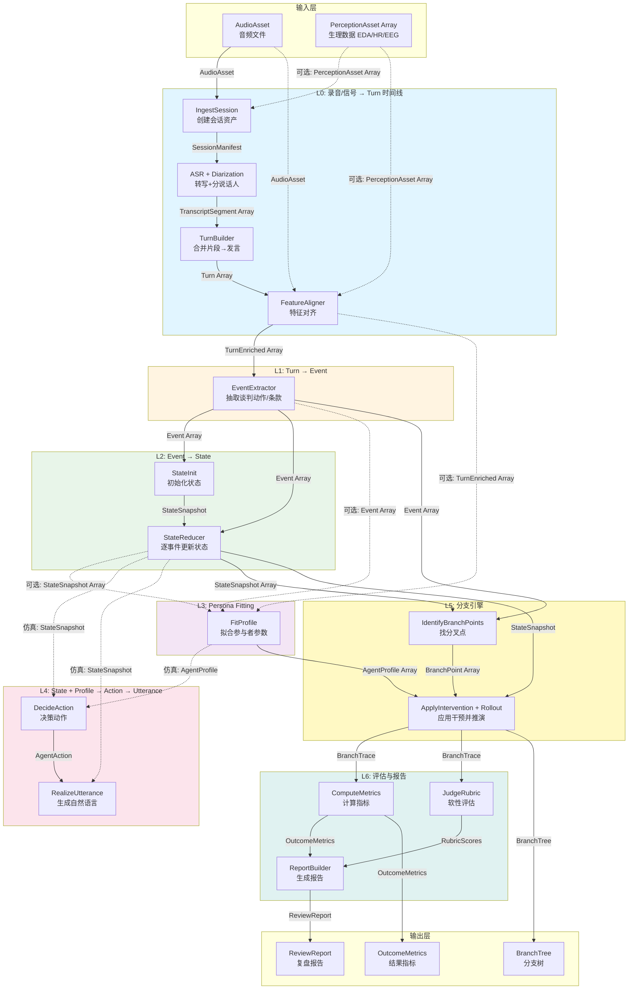
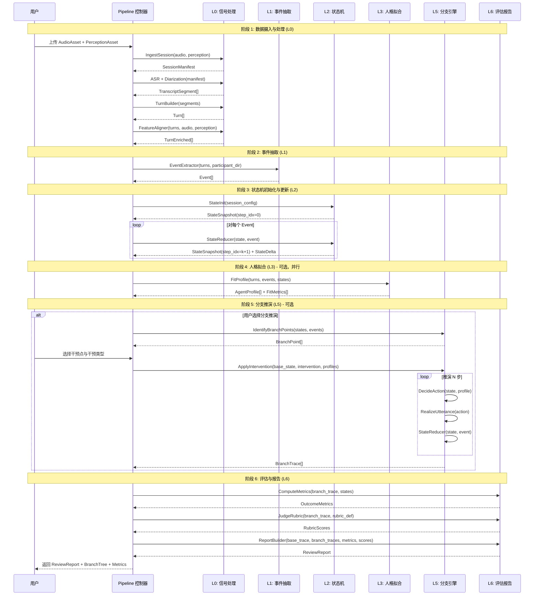
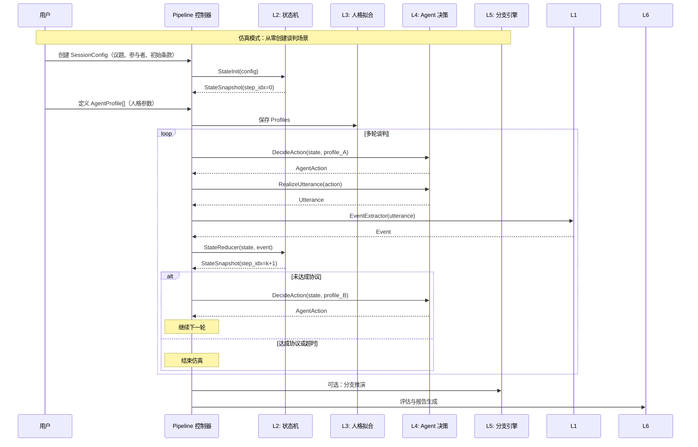

# Pipeline 数据流图与时序图

本文档包含谈判分析系统的 Pipeline 数据流图（DFD）和时序图（Sequence Diagram），用于可视化从原始音频输入到最终评估报告的完整流程。

---

## 1. Pipeline DFD（L0–L6 全局数据流）

### 1.1 完整数据流图



### 1.2 数据流说明与 Schema

#### L0 层：录音/信号 → Turn 时间线

**输入**：
- `AudioAsset`：音频文件（必需）
- `PerceptionAsset[]`：生理数据（可选）

**处理步骤**：
1. **IngestSession**：创建会话资产，生成 `SessionManifest`
2. **ASR + Diarization**：语音转文字 + 说话人分离，生成 `TranscriptSegment[]`
3. **TurnBuilder**：合并片段为完整发言，生成 `Turn[]`
4. **FeatureAligner**：对齐音频和生理特征，生成 `TurnEnriched[]`

**输出**：`TurnEnriched[]`（带时间戳、说话人、音频特征、生理特征的完整发言序列）

##### Schema 定义

**Input: AudioAsset**
```json
{
  "session_id": "uuid",
  "audio_uri": "s3://.../audio.wav",
  "sample_rate_hz": 16000,
  "duration_sec": 1832.4,
  "channels": 1,
  "recorded_at": "2026-01-22T18:03:11Z",
  "timezone": "America/New_York"
}
```

**字段说明**：
- `session_id` (string, UUID): 一次谈判/会议的唯一标识符
- `audio_uri` (string): 音频文件在存储系统中的位置（S3 URI 或其他存储路径）
- `sample_rate_hz` (integer): 音频采样率，单位赫兹（Hz），常见值如 16000、44100
- `duration_sec` (float): 音频总时长，单位秒
- `channels` (integer): 音频声道数，1=单声道，2=立体声
- `recorded_at` (string, ISO 8601): 录制时间的时间戳
- `timezone` (string): 录制时区，用于与外部数据（如生理数据）对齐

**Input: PerceptionAsset** (可选)
```json
{
  "session_id": "uuid",
  "participant_id": "uuid",
  "modality": "EDA",
  "data_uri": "s3://.../eda.csv",
  "sample_rate_hz": 32,
  "time_base": "unix_epoch_ms",
  "start_time_ms": 1737578591000
}
```

**字段说明**：
- `session_id` (string, UUID): 所属会话的唯一标识符
- `participant_id` (string, UUID): 该传感器数据所属的参与者（佩戴者）ID
- `modality` (string, enum): 生理/感知数据类型，可选值：`EDA`（皮电）、`HR`（心率）、`HRV`（心率变异）、`EEG`（脑电）、`RESP`（呼吸）、`TEMP`（皮温/体温）、`EYE`（眼动）、`ACC`（加速度）
- `data_uri` (string): 生理数据文件在存储系统中的位置
- `sample_rate_hz` (integer): 生理数据采样率，单位赫兹（Hz）
- `time_base` (string, enum): 时间基准类型，可选值：`unix_epoch_ms`（Unix 时间戳毫秒）、`unix_epoch_sec`（Unix 时间戳秒）、`relative_sec`（相对起点秒）
- `start_time_ms` (integer): 数据开始时间，单位毫秒（根据 time_base 解释）

**Output: SessionManifest** (L0.1)
```json
{
  "session_id": "uuid",
  "assets": {
    "audio": {"audio_uri":"..."},
    "perception": [{"modality":"EDA","data_uri":"..."}]
  },
  "status": "INGESTED"
}
```

**字段说明**：
- `session_id` (string, UUID): 会话唯一标识符
- `assets.audio` (object): 音频资产信息，包含 `audio_uri`（音频文件位置）
- `assets.perception` (array): 生理数据资产列表，每个元素包含 `modality`（数据类型）和 `data_uri`（数据文件位置）
- `status` (string, enum): 会话状态，可选值：`INGESTED`（已摄入）、`PENDING`（待处理）、`RUNNING`（处理中）、`SUCCEEDED`（成功）、`FAILED`（失败）

**Output: TranscriptSegment[]** (L0.2)
```json
{
  "session_id": "uuid",
  "segment_index": 0,
  "t0_sec": 12.30,
  "t1_sec": 18.90,
  "speaker_id": "spk_0",
  "text": "We can only do 120k.",
  "asr_confidence": 0.92,
  "words": [
    {"t0_sec":12.35,"t1_sec":12.60,"w":"We","conf":0.94},
    {"t0_sec":12.61,"t1_sec":12.90,"w":"can","conf":0.93}
  ]
}
```

**字段说明**：
- `session_id` (string, UUID): 所属会话的唯一标识符
- `segment_index` (integer): 片段在会话中的顺序索引（从 0 开始）
- `t0_sec` (float): 该片段在音频中的开始时间，单位秒
- `t1_sec` (float): 该片段在音频中的结束时间，单位秒
- `speaker_id` (string): 说话人标签（音频层），格式如 `spk_0`、`spk_1`，后续会映射到真实的 `participant_id`
- `text` (string): 转写的文本内容
- `asr_confidence` (float, 0.0-1.0): 自动语音识别（ASR）的置信度分数
- `words` (array, 可选): 逐词时间戳数组，每个元素包含：
  - `t0_sec` (float): 单词开始时间
  - `t1_sec` (float): 单词结束时间
  - `w` (string): 单词文本
  - `conf` (float): 该单词的识别置信度

**Output: Turn[]** (L0.3)
```json
{
  "session_id": "uuid",
  "turn_id": "uuid",
  "turn_index": 12,
  "t0_sec": 120.10,
  "t1_sec": 141.85,
  "speaker_id": "spk_0",
  "participant_id": null,
  "text": "We can only do 120k and we'd need delivery by March.",
  "lang": "en",
  "source_segments": [33,34,35]
}
```

**字段说明**：
- `session_id` (string, UUID): 所属会话的唯一标识符
- `turn_id` (string, UUID): 该发言的唯一标识符（UUID 或 `{session_id}:{index}` 格式）
- `turn_index` (integer): 发言在会话中的顺序编号（从 0 开始）
- `t0_sec` (float): 发言在音频中的开始时间，单位秒
- `t1_sec` (float): 发言在音频中的结束时间，单位秒
- `speaker_id` (string): 说话人标签（音频层），如 `spk_0`、`spk_1`
- `participant_id` (string, UUID, nullable): 真实参与者 ID，在 speaker→participant 映射完成前为 `null`
- `text` (string): 完整的发言文本（由多个 segment 合并而来）
- `lang` (string, ISO 639-1): 语言代码，如 `en`（英语）、`zh`（中文）
- `source_segments` (array of integers): 该 turn 由哪些 `TranscriptSegment` 合并而来（segment_index 列表），用于可追溯性

**Output: TurnEnriched[]** (L0.4)
```json
{
  "session_id": "uuid",
  "turn_id": "uuid",
  "t0_sec": 120.10,
  "t1_sec": 141.85,
  "speaker_id": "spk_0",
  "text": "...",
  "audio_features": {
    "speech_rate_wps": 2.9,
    "mean_pitch_hz": 185.2,
    "pitch_std_hz": 22.4,
    "energy_rms": 0.031,
    "pause_total_ms": 420
  },
  "physio_features": {
    "EDA": {
      "window": {"t0_sec":118.10,"t1_sec":143.85},
      "eda_mean": 0.12,
      "eda_slope": 0.008
    }
  }
}
```

**字段说明**：
- `session_id` (string, UUID): 所属会话的唯一标识符
- `turn_id` (string, UUID): 该发言的唯一标识符
- `t0_sec` (float): 发言开始时间，单位秒
- `t1_sec` (float): 发言结束时间，单位秒
- `speaker_id` (string): 说话人标签
- `text` (string): 发言文本（继承自 Turn）
- `audio_features` (object): 音频特征，包含：
  - `speech_rate_wps` (float): 语速，单位 words per second（每秒单词数）
  - `mean_pitch_hz` (float): 平均基频，单位赫兹（Hz），反映音调高低
  - `pitch_std_hz` (float): 基频标准差，单位赫兹，反映音调变化程度
  - `energy_rms` (float): 音频能量（RMS），反映音量大小
  - `pause_total_ms` (integer): turn 内停顿总时长，单位毫秒
- `physio_features` (object, 可选): 生理特征，键为 `modality`（如 `EDA`），值为：
  - `window` (object): 用于提取生理特征的时间窗，通常比 turn 稍微扩大
    - `t0_sec` (float): 窗口开始时间
    - `t1_sec` (float): 窗口结束时间
  - `eda_mean` (float, 示例): 该窗口内 EDA 的平均值
  - `eda_slope` (float, 示例): 该窗口内 EDA 的趋势斜率，正值表示紧张/唤醒上升

---

#### L1 层：Turn → Event

**输入**：
- `TurnEnriched[]`
- `ParticipantDirectory`（可选，用于映射说话人）

**处理步骤**：
1. **EventExtractor**：从每个 Turn 抽取谈判动作和条款

**输出**：`Event[]`（包含 act_type、terms、stance、intent、tone 等）

##### Schema 定义

**Input: ParticipantDirectory** (可选)
```json
{
  "session_id":"uuid",
  "speaker_to_participant": {
    "spk_0": "uuid-A",
    "spk_1": "uuid-B"
  },
  "participants": [
    {"participant_id":"uuid-A","display_name":"Person A","role":"Seller"},
    {"participant_id":"uuid-B","display_name":"Person B","role":"Buyer"}
  ]
}
```

**字段说明**：
- `session_id` (string, UUID): 所属会话的唯一标识符
- `speaker_to_participant` (object): 说话人 ID 到参与者 ID 的映射表，键为 `speaker_id`（如 `spk_0`），值为 `participant_id`（UUID）
- `participants` (array): 参与者信息列表，每个元素包含：
  - `participant_id` (string, UUID): 参与者的唯一标识符
  - `display_name` (string): 显示名称（用于 UI 和报告）
  - `role` (string): 角色，如 `Seller`（卖方）、`Buyer`（买方）

**Output: Event[]**
```json
{
  "session_id": "uuid",
  "event_id": "uuid",
  "turn_id": "uuid",
  "actor_participant_id": "uuid-A",
  "act_type": "ANCHOR",
  "act_subtype": null,
  "targets": ["uuid-B"],
  "terms": [
    {
      "term_type": "PRICE",
      "value": 120000,
      "currency": "USD",
      "confidence": 0.86,
      "evidence": {"text_span":"120k","char_start":17,"char_end":21}
    }
  ],
  "stance": "FIRM",
  "intent": "SET_BASELINE",
  "tone": {
    "valence": -0.1,
    "arousal": 0.4,
    "confidence": 0.7
  }
}
```

**字段说明**：
- `session_id` (string, UUID): 所属会话的唯一标识符
- `event_id` (string, UUID): 该谈判动作事件的唯一标识符
- `turn_id` (string, UUID): 来源的 Turn ID
- `actor_participant_id` (string, UUID): 执行该动作的参与者 ID
- `act_type` (string, enum): 动作类型，可选值：`OFFER`（提案）、`COUNTER`（反报价）、`CONCEDE`（让步）、`ACCEPT`（接受）、`REJECT`（拒绝）、`ASK`（提问）、`DISCLOSE`（透露信息）、`SUMMARIZE`（总结）、`ANCHOR`（锚定）、`JUSTIFY`（论证）、`REFRAME`（重构）、`BUILD_RAPPORT`（建立关系）、`THREATEN`（威胁）、`PAUSE`（暂停）
- `act_subtype` (string, nullable): 动作子类型，可选，如 `THREATEN` 的子类型：`WALK_AWAY`、`DEADLINE`、`ESCALATE`
- `targets` (array of UUIDs): 这句话主要针对的参与者 ID 列表（可为空或多人）
- `terms` (array): 条款抽取列表，每个元素包含：
  - `term_type` (string, enum): 条款类型，如 `PRICE`（价格）、`DEADLINE`（截止日期）、`SCOPE`（范围）、`PAYMENT_TERMS`（付款条件）等
  - `value` (number/string): 标准化后的数值（如 120k→120000）或文本值
  - `currency` (string, 可选): 货币代码，如 `USD`、`CNY`
  - `confidence` (float, 0.0-1.0): 抽取置信度
  - `evidence` (object): 在原 turn 文本中的位置证据，用于可解释性/高亮：
    - `text_span` (string): 原文片段
    - `char_start` (integer): 字符起始位置
    - `char_end` (integer): 字符结束位置
- `stance` (string, enum): 态度/开放程度，可选值：`FIRM`（强硬）、`OPEN`（开放）、`CONDITIONAL`（有条件）、`HESITANT`（犹豫）、`NONCOMMITTAL`（模糊）
- `intent` (string, enum): 高层意图，可选值：`SET_BASELINE`（设定基准）、`SEEK_CONCESSION`（争取让步）、`TEST_LIMITS`（测试底线）、`SHARE_CONSTRAINT`（说明约束）、`BUILD_TRUST`（建立信任）、`REDUCE_TENSION`（降温）、`GAIN_TIME`（争取时间）、`CLOSE_DEAL`（推进成交）、`SHIFT_TOPIC`（转移议题）、`ESCALATE_PRESSURE`（施压升级）
- `tone` (object): 情绪/语气的结构化表示（可由音频+文本融合推断）：
  - `valence` (float, -1.0 to 1.0): 情感效价，负值=负面，正值=正面
  - `arousal` (float, 0.0 to 1.0): 唤醒度，0=平静，1=激动
  - `confidence` (float, 0.0-1.0): 语气识别的置信度

---

#### L2 层：Event → State

**输入**：
- `SessionConfig`（初始化用）
- `Event[]`（状态更新用）
- `AgentProfile[]`（可选，用于更合理更新）

**处理步骤**：
1. **StateInit**：初始化谈判世界状态
2. **StateReducer**：逐事件更新状态，生成状态快照序列

**输出**：
- `StateSnapshot[]`（每个 step_idx 的状态）
- `StateDelta[]`（状态变化描述）

##### Schema 定义

**Input: SessionConfig** (L2.1)
```json
{
  "session_id":"uuid",
  "issues":[
    {"term_type":"PRICE","unit":"USD"},
    {"term_type":"DEADLINE","unit":"ISO_DATE"}
  ],
  "initial_terms": {},
  "participants":[
    {"participant_id":"uuid-A","role":"Seller"},
    {"participant_id":"uuid-B","role":"Buyer"}
  ]
}
```

**字段说明**：
- `session_id` (string, UUID): 会话唯一标识符
- `issues` (array): 谈判议题列表，每个元素包含：
  - `term_type` (string, enum): 条款类型，如 `PRICE`、`DEADLINE`、`SCOPE` 等
  - `unit` (string): 单位，如 `USD`（美元）、`ISO_DATE`（ISO 日期格式）
- `initial_terms` (object): 初始条款值（结构化），键为 `term_type`，值为对应的初始值
- `participants` (array): 参与者列表，每个元素包含：
  - `participant_id` (string, UUID): 参与者唯一标识符
  - `role` (string): 角色，如 `Seller`（卖方）、`Buyer`（买方）

**Output: StateSnapshot** (L2.1)
```json
{
  "session_id":"uuid",
  "state_id":"uuid",
  "step_idx": 0,
  "last_event_id": null,
  "terms": {},
  "beliefs": {},
  "relationship": {"trust": 0.5, "tension": 0.0},
  "emotion": {"uuid-A":{"anger":0.0,"stress":0.2},"uuid-B":{"anger":0.0,"stress":0.2}},
  "meta": {"round":1}
}
```

**字段说明**：
- `session_id` (string, UUID): 会话唯一标识符
- `state_id` (string, UUID): 该状态快照的唯一标识符
- `step_idx` (integer): 离散推演的步数（0, 1, 2...），通常与事件序列对齐
- `last_event_id` (string, UUID, nullable): 导致该状态的上一个事件 ID，初始状态为 `null`
- `terms` (object): 当前条款（结构化），键为 `term_type`（如 `PRICE`），值为对应的当前值
- `beliefs` (object): 对对方底线/偏好的估计（概率分布/区间），键为 `belief_key`（如 `opponent_min_price`），值为分布参数
- `relationship` (object): 关系状态，包含：
  - `trust` (float, 0.0-1.0): 信任度，0=不信任，1=完全信任
  - `tension` (float, 0.0-1.0): 对抗/紧张度，0=和谐，1=高度紧张
  - `alignment` (float, 0.0-1.0): 目标一致性/合作倾向，0=对立，1=一致
- `emotion` (object): 每个参与者的情绪状态，键为 `participant_id`，值为情绪维度对象：
  - `anger` (float, 0.0-1.0): 愤怒/敌意
  - `stress` (float, 0.0-1.0): 压力/紧张
  - `confidence` (float, 0.0-1.0): 自信/掌控感
  - `warmth` (float, 0.0-1.0): 友好/亲和
- `meta` (object): 元数据，包含：
  - `round` (integer): 谈判轮次（可自定义轮次逻辑）

**Output: StateDelta** (L2.2)
```json
{
  "session_id":"uuid",
  "from_state_id":"uuid_prev",
  "to_state_id":"uuid_next",
  "event_id":"uuid_evt",
  "deltas": {
    "terms": [{"op":"SET","path":"$.PRICE","value":120000}],
    "relationship": [{"op":"ADD","path":"$.tension","value":0.10}],
    "emotion": [{"op":"ADD","path":"$.uuid-B.stress","value":0.15}]
  },
  "rationale": "Anchor increased tension slightly; buyer stress rose due to high initial price."
}
```

**字段说明**：
- `session_id` (string, UUID): 会话唯一标识符
- `from_state_id` (string, UUID): 源状态 ID
- `to_state_id` (string, UUID): 目标状态 ID
- `event_id` (string, UUID): 导致该变化的事件 ID
- `deltas` (object): 像 JSON patch 的形式描述变化（利于回放/分支），键为状态字段名（如 `terms`、`relationship`、`emotion`），值为操作列表，每个操作包含：
  - `op` (string, enum): 操作类型，如 `SET`（设置）、`ADD`（增加）、`REMOVE`（移除）
  - `path` (string): JSON 路径，如 `$.PRICE`、`$.tension`、`$.uuid-B.stress`
  - `value` (any): 操作的值
- `rationale` (string, 可选): 变化原因的解释说明

---

#### L3 层：Persona Fitting

**输入**：
- `TurnEnriched[]`
- `Event[]`
- `StateSnapshots[]`（可选但很有帮助）

**处理步骤**：
1. **FitProfile**：从轨迹拟合每个参与者的行为参数

**输出**：
- `AgentProfile[]`（traits、tactic_priors、trigger_rules、utility_weights）
- `FitMetrics[]`（拟合质量指标）

##### Schema 定义

**Output: AgentProfile**
```json
{
  "session_id":"uuid",
  "participant_id":"uuid-A",
  "profile_version":"v1",
  "traits": {
    "dominance": 0.78,
    "agreeableness": 0.22,
    "risk_aversion": 0.55
  },
  "tactic_priors": {
    "ANCHOR": 0.60,
    "CONCEDE": 0.20,
    "THREATEN": 0.05,
    "ASK": 0.15
  },
  "trigger_rules": [
    {
      "trigger_id":"t1",
      "condition": {"type":"INTERRUPT_COUNT_GTE","value":2},
      "effect": {"emotion_delta":{"anger":0.25}}
    }
  ],
  "utility_weights": {
    "PRICE": 0.60,
    "TIME": 0.15,
    "RELATIONSHIP": 0.25
  }
}
```

**字段说明**：
- `session_id` (string, UUID): 会话唯一标识符
- `participant_id` (string, UUID): 该 Profile 所属的参与者 ID
- `profile_version` (string): Profile 版本号，如 `v1`
- `traits` (object): 稳定人格/行为特质（0-1 归一化），包含：
  - `dominance` (float, 0.0-1.0): 支配性/强势程度
  - `agreeableness` (float, 0.0-1.0): 宜人性/合作程度
  - `risk_aversion` (float, 0.0-1.0): 风险厌恶程度
  - `patience` (float, 0.0-1.0): 耐心/愿意拖延的程度
  - `emotional_reactivity` (float, 0.0-1.0): 情绪反应强度（容易上头的程度）
- `tactic_priors` (object): 动作先验概率（归一化总和≈1），键为 `act_type`，值为该动作的概率
- `trigger_rules` (array): 触发器规则列表，每个元素包含：
  - `trigger_id` (string): 触发器唯一标识符
  - `condition` (object): 触发条件，包含：
    - `type` (string, enum): 条件类型，如 `INTERRUPT_COUNT_GTE`（被打断次数≥N）、`TENSION_GTE`（紧张度≥阈值）、`CONCESSION_FROM_OPPONENT`（对方让步发生）
    - `value` (number): 条件阈值或参数
  - `effect` (object): 触发效果，包含：
    - `emotion_delta` (object, 可选): 情绪增量，键为情绪维度（如 `anger`、`stress`），值为增量值
    - `tactic_prior_shift` (object, 可选): 策略先验偏移
    - `tone_style_override` (string, 可选): 强制语气覆盖
- `utility_weights` (object): 效用权重（用于 L4/L6），键为 `term_type` 或通用维度（如 `TIME`、`RELATIONSHIP`），值为权重（总和通常为 1.0）

**Output: FitMetrics**
```json
{
  "session_id":"uuid",
  "participant_id":"uuid-A",
  "next_act_prediction_f1": 0.61,
  "confidence": 0.72,
  "notes": "Profile explains most concessions but underpredicts threats."
}
```

**字段说明**：
- `session_id` (string, UUID): 会话唯一标识符
- `participant_id` (string, UUID): 该指标所属的参与者 ID
- `next_act_prediction_f1` (float, 0.0-1.0): 使用该 Profile 预测下一个动作的 F1 分数（衡量拟合质量）
- `confidence` (float, 0.0-1.0): 拟合置信度
- `notes` (string): 拟合质量说明和注意事项

---

#### L4 层：State + Profile → Action → Utterance（仿真用）

**输入**：
- `StateSnapshot`
- `AgentProfile`
- `LastKContext`（最近 K 个事件摘要）

**处理步骤**：
1. **DecideAction**：基于状态和人格决策下一步动作
2. **RealizeUtterance**：将动作转换为自然语言

**输出**：
- `AgentAction[]`
- `Utterance[]`

##### Schema 定义

**Output: AgentAction** (L4.1)
```json
{
  "session_id":"uuid",
  "step_idx": 35,
  "actor_participant_id":"uuid-B",
  "action": {
    "act_type":"COUNTER",
    "terms":[{"term_type":"PRICE","value":95000,"currency":"USD"}],
    "tone_style":"CALM",
    "strategy_tags":["SIGNAL_LIMIT","KEEP_RELATIONSHIP"],
    "rationale":"Counter to move anchor down while maintaining rapport."
  }
}
```

**字段说明**：
- `session_id` (string, UUID): 会话唯一标识符
- `step_idx` (integer): 该动作发生的步数索引
- `actor_participant_id` (string, UUID): 执行该动作的参与者 ID
- `action` (object): 动作详情，包含：
  - `act_type` (string, enum): 动作类型（同 Event.act_type）
  - `terms` (array): 条款列表（同 Event.terms）
  - `tone_style` (string, enum): 语言风格/语气，可选值：`CALM`（冷静）、`ASSERTIVE`（坚定）、`FRIENDLY`（友好）、`APOLOGETIC`（歉意）、`AGGRESSIVE`（攻击）、`FORMAL`（正式）、`CASUAL`（随意）、`UNCERTAIN`（不确定）
  - `strategy_tags` (array of strings): 策略标签，用于决策解释/教学，可选值：`SIGNAL_LIMIT`（表明底线）、`PROBE_LIMIT`（探底线）、`TRADE_OFF`（交换条件）、`SPLIT_THE_DIFFERENCE`（折中）、`PACKAGE_DEAL`（打包议题）、`SLOW_CONCEDE`（慢让步）、`FAST_CLOSE`（快速成交）、`DE_ESCALATE`（降温）等
  - `rationale` (string): 决策理由说明

**Output: Utterance** (L4.2)
```json
{
  "session_id":"uuid",
  "step_idx":35,
  "actor_participant_id":"uuid-B",
  "text":"I hear you. Given our constraints, we could move forward at $95k if we can lock the March delivery date.",
  "constraints_check": {
    "terms_consistent": true,
    "no_new_terms_introduced": true
  }
}
```

**字段说明**：
- `session_id` (string, UUID): 会话唯一标识符
- `step_idx` (integer): 该发言发生的步数索引
- `actor_participant_id` (string, UUID): 发言的参与者 ID
- `text` (string): 生成的自然语言文本
- `constraints_check` (object): 自动校验结果，包含：
  - `terms_consistent` (boolean): 语言中的条款是否与 AgentAction 中的 terms 一致
  - `no_new_terms_introduced` (boolean): 是否引入了新的未在 AgentAction 中定义的条款（应该为 `true`）

---

#### L5 层：分支引擎

**输入**：
- `StateSnapshots[]`
- `Events[]`
- `Intervention`（用户指定的干预）
- `Profiles[]`

**处理步骤**：
1. **IdentifyBranchPoints**：识别关键分叉点
2. **ApplyIntervention + Rollout**：应用干预并推演未来

**输出**：
- `BranchPoint[]`
- `BranchTrace[]` / `BranchTree`

##### Schema 定义

**Output: BranchPoint[]** (L5.1)
```json
{
  "session_id":"uuid",
  "branch_point_id":"uuid",
  "step_idx": 28,
  "reason": "High tension jump after THREATEN",
  "candidate_interventions": [
    {"type":"REPLACE_ACT","from":"THREATEN","to":"REFRAME"},
    {"type":"CLAMP_EMOTION","participant_id":"uuid-A","field":"anger","value":0.0}
  ]
}
```

**字段说明**：
- `session_id` (string, UUID): 会话唯一标识符
- `branch_point_id` (string, UUID): 分叉点的唯一标识符
- `step_idx` (integer): 分叉点所在的步数索引
- `reason` (string): 识别该分叉点的原因说明
- `candidate_interventions` (array): 候选干预方案列表，每个元素包含：
  - `type` (string, enum): 干预类型，如 `REPLACE_ACT`（替换动作）、`CLAMP_EMOTION`（夹紧情绪）、`EDIT_TERMS`（修改条款）等
  - `from` (string, 可选): 源值（如 `REPLACE_ACT` 的源动作类型）
  - `to` (string, 可选): 目标值（如 `REPLACE_ACT` 的目标动作类型）
  - `participant_id` (string, UUID, 可选): 目标参与者 ID
  - `field` (string, 可选): 目标字段（如 `anger`、`stress`）
  - `value` (any, 可选): 目标值

**Input: Intervention** (L5.2)
```json
{
  "type":"CLAMP_EMOTION",
  "participant_id":"uuid-A",
  "field":"anger",
  "value":0.0,
  "duration_steps": 3
}
```

**字段说明**：
- `type` (string, enum): 干预类型，可选值：`REPLACE_ACT`（替换某个动作）、`EDIT_TERMS`（修改条款）、`CLAMP_EMOTION`（夹紧情绪）、`ADD_TRIGGER`（添加触发器）、`REMOVE_EVENT`（移除某事件）、`INFO_HIDE`（信息遮蔽）、`POLICY_SHIFT`（临时改变 profile 参数）
- `participant_id` (string, UUID): 目标参与者 ID
- `field` (string): 目标字段，如情绪维度（`anger`、`stress`）或其他状态字段
- `value` (any): 目标值
- `duration_steps` (integer): 干预持续步数（如为 0 或未指定，则持续到推演结束）

**Output: BranchTrace**
```json
{
  "session_id":"uuid",
  "branch_id":"b1",
  "parent_branch_id": null,
  "start_step_idx": 28,
  "steps":[
    {"step_idx":29,"state_id":"...","action_id":"...","utterance_id":"..."},
    {"step_idx":30,"state_id":"...","action_id":"...","utterance_id":"..."}
  ]
}
```

**字段说明**：
- `session_id` (string, UUID): 会话唯一标识符
- `branch_id` (string): 分支路径的唯一标识符
- `parent_branch_id` (string, nullable): 父分支 ID（如果是子分支），`null` 表示根分支
- `start_step_idx` (integer): 分支开始的步数索引
- `steps` (array): 分支路径中的步骤列表，每个元素包含：
  - `step_idx` (integer): 步数索引
  - `state_id` (string, UUID): 该步的状态快照 ID
  - `action_id` (string, UUID): 该步的动作 ID（可选）
  - `utterance_id` (string, UUID): 该步的发言 ID（可选）

---

#### L6 层：评估与报告

**输入**：
- `BranchTrace`
- `StateSnapshots`
- `RubricDefinition`

**处理步骤**：
1. **ComputeMetrics**：计算规则指标
2. **JudgeRubric**：软性评估（话术/策略）
3. **ReportBuilder**：生成复盘/对比报告

**输出**：
- `OutcomeMetrics`
- `RubricScores`
- `ReviewReport`

##### Schema 定义

**Output: OutcomeMetrics** (L6.1)
```json
{
  "session_id":"uuid",
  "branch_id":"b1",
  "agreement_reached": true,
  "final_terms": {"PRICE": 102000, "DEADLINE":"2026-03-01"},
  "utility": {"uuid-A": 0.62, "uuid-B": 0.58},
  "relationship_damage": 0.18,
  "volatility": 0.22,
  "efficiency_rounds": 6
}
```

**字段说明**：
- `session_id` (string, UUID): 会话唯一标识符
- `branch_id` (string): 评估的分支 ID
- `agreement_reached` (boolean): 是否达成协议
- `final_terms` (object): 最终条款（结构化），键为 `term_type`，值为最终值
- `utility` (object): 归一化效用（基于 utility_weights 或预设曲线），键为 `participant_id`，值为效用分数（0.0-1.0）
- `relationship_damage` (float, 0.0-1.0): 相对基线的关系损伤，0=无损伤，1=完全破裂
- `volatility` (float, 0.0-1.0): 情绪/冲突波动程度，0=稳定，1=高度波动
- `efficiency_rounds` (integer): 达成协议所用的轮次数

**Output: RubricScores** (L6.2)
```json
{
  "session_id":"uuid",
  "branch_id":"b1",
  "scores": {
    "clarity": 8.2,
    "empathy": 7.6,
    "leverage": 6.9,
    "coherence": 8.8
  },
  "highlights": [
    {"step_idx":35,"type":"GOOD_MOVE","note":"Reframed without conceding too early."}
  ],
  "risks":[
    {"step_idx":37,"type":"RISK","note":"Introduced deadline condition could trigger resistance."}
  ]
}
```

**字段说明**：
- `session_id` (string, UUID): 会话唯一标识符
- `branch_id` (string): 评估的分支 ID
- `scores` (object): LLM 软评分维度（通常 0-10 分），包含：
  - `clarity` (float): 清晰度，表达是否清楚明确
  - `empathy` (float): 共情，是否理解对方感受
  - `leverage` (float): 筹码/策略性，是否有效运用谈判技巧
  - `coherence` (float): 一致性，是否自相矛盾
  - `professionalism` (float, 可选): 职业度
  - `creativity` (float, 可选): 创造性解决方案
- `highlights` (array): 高亮的好决策点，每个元素包含：
  - `step_idx` (integer): 步数索引
  - `type` (string, enum): 高亮类型，如 `GOOD_MOVE`（好招）、`MISSED_OPPORTUNITY`（错失机会）
  - `note` (string): 说明
- `risks` (array): 识别的风险点，每个元素包含：
  - `step_idx` (integer): 步数索引
  - `type` (string, enum): 风险类型，如 `RISK`（风险）、`ESCALATION`（升级）、`DE_ESCALATION`（降温）
  - `note` (string): 风险说明

**Output: ReviewReport** (L6.3)
```json
{
  "session_id":"uuid",
  "summary": "...",
  "key_moments":[{"step_idx":28,"why":"tension spike","what_to_try":["reframe","pause"]}],
  "branch_comparison":[
    {"branch_id":"base","agreement":false,"utility_avg":0.41},
    {"branch_id":"b1","agreement":true,"utility_avg":0.60}
  ],
  "recommendations":[
    {"for_participant":"uuid-A","rule":"When tension>0.7, avoid THREATEN; use REFRAME + ask constraint."}
  ]
}
```

**字段说明**：
- `session_id` (string, UUID): 会话唯一标识符
- `summary` (string): 会话总结文本
- `key_moments` (array): 关键时刻分析，每个元素包含：
  - `step_idx` (integer): 步数索引
  - `why` (string): 为什么是关键时刻
  - `what_to_try` (array of strings): 建议尝试的策略列表
- `branch_comparison` (array): 分支对比，每个元素包含：
  - `branch_id` (string): 分支 ID
  - `agreement` (boolean): 是否达成协议
  - `utility_avg` (float): 平均效用（所有参与者的平均）
- `recommendations` (array): 建议和规则，每个元素包含：
  - `for_participant` (string, UUID): 针对的参与者 ID（如为 `null` 则适用于所有参与者）
  - `rule` (string): 可迁移的谈判规则或建议

---

## 2. Sequence Diagram（一次完整 Pipeline 的时序）

### 2.1 完整 Pipeline 时序图



### 2.2 详细时序说明

#### 阶段 1: 数据摄入与处理 (L0)

**时序**：
1. 用户上传 `AudioAsset` 和可选的 `PerceptionAsset[]`
2. `IngestSession` 创建会话资产，返回 `SessionManifest`
3. `ASR + Diarization` 进行语音转写和说话人分离，返回 `TranscriptSegment[]`
4. `TurnBuilder` 合并片段为完整发言，返回 `Turn[]`
5. `FeatureAligner` 对齐音频和生理特征，返回 `TurnEnriched[]`

**耗时**：取决于音频长度，通常 1-5 分钟音频需要 30 秒-2 分钟

---

#### 阶段 2: 事件抽取 (L1)

**时序**：
1. `EventExtractor` 接收 `TurnEnriched[]` 和可选的 `ParticipantDirectory`
2. 对每个 Turn 进行事件抽取（LLM 调用）
3. 返回 `Event[]`，包含 act_type、terms、stance、intent 等

**耗时**：每个 Turn 约 1-3 秒（取决于 LLM 响应时间）

---

#### 阶段 3: 状态机初始化与更新 (L2)

**时序**：
1. `StateInit` 根据 `SessionConfig` 初始化初始状态（step_idx=0）
2. 对每个 `Event` 按时间顺序：
   - 调用 `StateReducer` 更新状态
   - 生成新的 `StateSnapshot` 和 `StateDelta`

**耗时**：每个事件的状态更新约 0.1-0.5 秒

---

#### 阶段 4: 人格拟合 (L3) - 可选，并行

**时序**：
1. `FitProfile` 接收 `TurnEnriched[]`、`Event[]`、`StateSnapshots[]`
2. 对每个参与者拟合行为参数（traits、tactic_priors、trigger_rules、utility_weights）
3. 返回 `AgentProfile[]` 和 `FitMetrics[]`

**耗时**：取决于数据量，通常 10-30 秒

**注意**：此阶段可以与 L2 并行执行，也可以在所有数据收集完成后执行

---

#### 阶段 5: 分支推演 (L5) - 可选

**时序**：
1. `IdentifyBranchPoints` 分析状态序列，识别关键分叉点
2. 用户选择干预点和干预类型
3. `ApplyIntervention` 应用干预到基础状态
4. 循环推演 N 步：
   - `DecideAction`：基于当前状态和 Profile 决策动作
   - `RealizeUtterance`：将动作转换为自然语言
   - `StateReducer`：更新状态
5. 返回 `BranchTrace[]`

**耗时**：每个分支推演 N 步约 N × (2-5) 秒

---

#### 阶段 6: 评估与报告 (L6)

**时序**：
1. `ComputeMetrics` 计算规则指标（agreement_reached、utility、relationship_damage 等）
2. `JudgeRubric` 进行软性评估（clarity、empathy、leverage 等）
3. `ReportBuilder` 生成综合报告，包含：
   - 关键时刻分析
   - 分支对比
   - 建议和规则

**耗时**：约 5-15 秒

---

### 2.3 仿真模式时序图（L4 使用场景）



---

## 3. 数据流关键路径

### 3.1 主要数据流路径

```
AudioAsset + PerceptionAsset[]
    ↓
SessionManifest
    ↓
TranscriptSegment[]
    ↓
Turn[]
    ↓
TurnEnriched[] ──┐
    ↓            │
Event[] ────────┼──→ AgentProfile[] (L3)
    ↓            │
StateSnapshot[] ─┘
    ↓
BranchTrace[]
    ↓
OutcomeMetrics + RubricScores
    ↓
ReviewReport
```

### 3.2 并行处理路径

- **L3 (Persona Fitting)** 可以与 L2 (State Updates) 并行执行
- **L5 (Branch Rollout)** 的多个分支可以并行推演
- **L6 (Evaluation)** 的多个评估任务可以并行执行

### 3.3 数据依赖关系

**强依赖**：
- L1 依赖 L0 的输出
- L2 依赖 L1 的输出
- L4 依赖 L2 和 L3 的输出
- L5 依赖 L2 的输出（可选依赖 L3）
- L6 依赖 L5 的输出

**可选依赖**：
- L1 可选依赖 ParticipantDirectory
- L2 可选依赖 AgentProfile（用于更合理的状态更新）
- L3 可选依赖 StateSnapshots（但很有帮助）

---

## 4. 性能考虑

### 4.1 典型耗时估算

| 阶段 | 输入规模 | 典型耗时 |
|------|---------|---------|
| L0: 信号处理 | 30 分钟音频 | 2-5 分钟 |
| L1: 事件抽取 | 100 个 Turn | 2-5 分钟 |
| L2: 状态更新 | 100 个 Event | 10-50 秒 |
| L3: 人格拟合 | 完整会话 | 10-30 秒 |
| L4: Agent 决策 | 单步 | 2-5 秒 |
| L5: 分支推演 | 10 步 × 3 分支 | 1-3 分钟 |
| L6: 评估报告 | 单分支 | 5-15 秒 |

**总耗时**（完整 Pipeline）：
- **复盘模式**：5-15 分钟（取决于音频长度和事件数量）
- **仿真模式**：实时（每步 2-5 秒）
- **分支推演**：额外 1-3 分钟/分支

### 4.2 优化建议

1. **并行处理**：
   - L3 可以与 L2 并行
   - L5 的多个分支可以并行推演
   - L6 的多个评估任务可以并行

2. **缓存策略**：
   - L0 的输出可以缓存（音频处理结果）
   - L3 的输出可以缓存（Profile 可以复用）

3. **增量处理**：
   - L2 的状态更新是增量的，可以流式处理
   - L1 的事件抽取可以按批次处理

---

## 5. 错误处理与回退

### 5.1 关键错误点

1. **L0: ASR 失败**
   - 回退：使用备用 ASR 服务或人工转录

2. **L1: 事件抽取失败**
   - 回退：使用规则抽取或人工标注

3. **L2: 状态更新异常**
   - 回退：跳过该事件或使用默认状态更新

4. **L3: 拟合失败**
   - 回退：使用默认 Profile 或跳过拟合

5. **L5: 推演发散**
   - 回退：提前终止或使用保守策略

### 5.2 数据验证检查点

- **L0 → L1**：验证 Turn 数量 > 0
- **L1 → L2**：验证 Event 数量 > 0，包含必需的 act_type
- **L2 → L3**：验证 StateSnapshot 序列完整性
- **L3 → L4**：验证 Profile 参数在合理范围内
- **L5 → L6**：验证 BranchTrace 完整性

---

## 附录：Mermaid 图表说明

本文档使用 [Mermaid](https://mermaid.js.org/) 语法绘制图表。支持的 Markdown 编辑器（如 VS Code、GitHub、GitLab）可以直接渲染这些图表。

如果您的编辑器不支持 Mermaid，可以使用：
- [Mermaid Live Editor](https://mermaid.live/)
- [VS Code Mermaid 插件](https://marketplace.visualstudio.com/items?itemName=bierner.markdown-mermaid)
